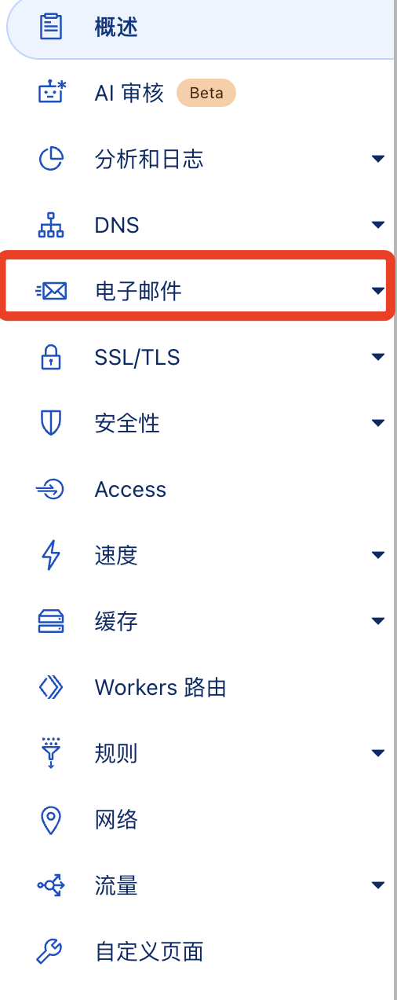
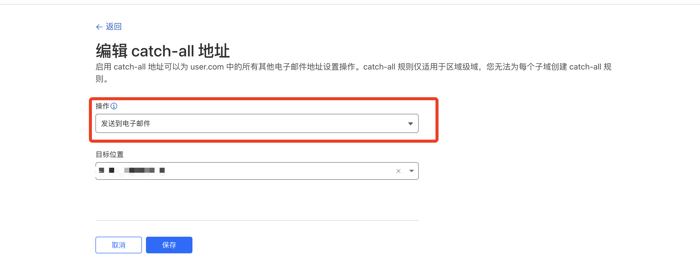

# Cursor Pro 自动化工具使用说明

自动注册账号，自动刷新本地token，解放双手。

## 使用前提

::: warning 如何快速开始？

1.确保电脑安装了Google Chrome浏览器，没有？[请点击这里下载。](https://www.google.cn/intl/zh-CN/chrome/)

2.Cursor Web端必须登录账号，不管账号是否有效，登录是必须的。

3.确保电脑网络流畅，最好有国外的节点。不要开全局代理！
:::

## 下载地址

https://github.com/chengazhen/cursor-auto-free/releases

> 根据自己电脑版本来选择，Mac注意一定要选择对应的版本，Apple Silicon(m芯片)请选择ARM64(aarch64)。
> Mac执行脚本还要一条命令变为可执行文件。

```shell
chmod +x ./CursorPro
```

双击执行即可执行，如果出现下图的情况，[点击这里查看解决方法](https://sysin.org/blog/macos-if-crashes-when-opening/)


## 使用脚本前需进行以下配置：

1.使用[Temp Mail临时邮箱](https://tempmail.plus/zh/#!)
>（1）将自己的域名托管到CF，托管好后点击左侧的电子邮件。（如下图）



> 然后点击路由规则


> 点击右侧编辑


> 操作选择发送到电子邮件，目标位置填你的临时邮箱



> CF配置好之后，下载[.env.example](https://github.com/chengazhen/cursor-auto-free)


重命名为.env，mac如果出现无法更改的情况。请打开终端，cd到你的项目目录，使用以下命令创建。
```shell
touch .env
```

> 创建好.env文件后还需进行配置：
> 
> DOMAIN='xxxxx.me'    # 你的邮箱域名
> 
> TEMP_MAIL='xxxxxx'   # 临时邮箱，就是你cloudflare设置的目标位置

2.使用 IMAP 来代替 tempmail.plus 邮箱

还是进入.env文件进行配置：
```text
DOMAIN='wozhangsan.me'
TEMP_MAIL=null

# IMAP服务器
IMAP_SERVER=imap.xxxxx.com (例如：qq邮箱，谷歌邮箱）
# IMAP的SSL端口
IMAP_PORT=993  （可以google搜索端口，QQ是995，Gmail是993）
# 使用cf转发到的邮箱
IMAP_USER=xxxxxx@xxxxx.com （你的QQ邮箱或者谷歌邮箱，需要在CF配置为catch-all，参考上面步骤）
# 邮箱授权码
IMAP_PASS=xxxxxxxxxxxxx
# [可选] 默认是收件箱(inbox)
# 你也可以设置成其他的文件夹，只要你可以收到
IMAP_DIR=
```


## 免责声明

本工具仅供学习研究使用，请遵守相关服务条款。使用本工具产生的任何后果由使用者自行承担。严禁将本工具用于任何商业用途，包括但不限于销售、租赁或其他营利行为。违反许可证条款的行为将承担相应的法律责任。

## 请作者喝一杯奶茶（这样才有更新的动力）

